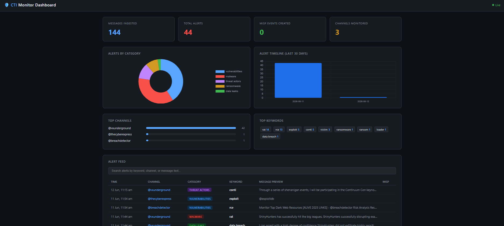

# Telegram CTI Monitor

Real-time Telegram channel monitor for Cyber Threat Intelligence.
Ingests messages, matches keywords and IOCs, and pushes hits to MISP.



---

## Architecture

```
Telegram Channels
      │
      ▼
  monitor.py          ← Telethon listener (real-time + history backfill)
      │
      ├──► alerter.py      ← Keyword + regex IOC matching engine
      │
      ├──► database.py     ← SQLite storage (messages + alerts)
      │
      └──► misp_push.py    ← Creates MISP events with IOC attributes
```

---

## Setup (WSL2)

### 1. Install dependencies

```bash
cd ~/telegram-cti-monitor
pip install -r requirements.txt
```

### 2. Get Telegram API credentials

1. Go to https://my.telegram.org
2. Log in with your Telegram account
3. Click **API Development Tools**
4. Create a new application (name/description can be anything)
5. Copy your **App api_id** and **App api_hash**

### 3. Get your MISP auth key

1. Open your MISP instance in the browser
2. Go to **Event Actions → Automation**
3. Copy the **Automation Key** at the top of the page

### 4. Configure

Edit `config.yaml` and fill in:
- `telegram.api_id`
- `telegram.api_hash`
- `misp.url` (e.g. `http://localhost`)
- `misp.auth_key`

### 5. Add channels to monitor

Edit `channels.txt` — one channel per line:

```
@vxunderground
@darkwebinformer
@cybersecuritynews
```

You must already be a **member** of private channels.
For public channels the monitor joins automatically.

### 6. Run

```bash
python monitor.py
```

**First run:** Telethon will ask for your phone number and a login code
sent to your Telegram app. This creates a local session file so you
only need to do this once.

---

## Commands

```bash
# Start monitoring
python monitor.py

# Use a different config or channels file
python monitor.py --config myconfig.yaml --channels mychannels.txt

# Print stats from the database and exit
python monitor.py --stats
```

---

## How it works

### On startup
- Connects to Telegram using your API credentials
- Resolves each channel in channels.txt
- Backfills the last 100 messages from each channel into SQLite
- Starts real-time listener

### On every new message
1. Text is scanned against all keyword categories and IOC regex patterns
2. If no match — stored in DB silently
3. If match:
   - Logged to terminal (colour-coded)
   - Saved to `alerts` table in SQLite
   - MISP event created with:
     - Source metadata (channel, date)
     - Original message text
     - Triggering keyword
     - Any extracted IOCs as typed attributes (ip-dst, sha256, domain, etc.)
     - Tags: tlp:amber, type:osint, source:telegram
   - A summary DM is sent to your own Telegram (Saved Messages)

### Rate limiting
A configurable delay (`rate_limit_seconds`) is applied between messages
to avoid hitting Telegram's API limits. Default is 1 second.

---

## Keyword categories (config.yaml)

| Category        | What it catches                                      |
|-----------------|------------------------------------------------------|
| threat_actors   | APT group names, ransomware gang names               |
| malware         | Malware family names, tool names (Cobalt Strike etc) |
| vulnerabilities | CVE numbers, RCE, zero-day, PoC mentions             |
| data_leaks      | Credential dumps, initial access sales, combolists   |
| ransomware      | Ransom, leak site, double extortion, victim mentions |
| ioc_patterns    | Regex: IPv4, domains, MD5/SHA1/SHA256 hashes         |

Add/remove keywords freely in `config.yaml` — no code changes needed.

---

## Database

SQLite file: `cti_monitor.db`

Two tables:
- `messages` — every ingested message
- `alerts`   — every keyword/IOC hit, linked to MISP event UUID

Query examples:

```sql
-- All ransomware alerts today
SELECT channel, matched_keyword, message_text, created_at
FROM alerts
WHERE category = 'ransomware'
  AND date(created_at) = date('now')
ORDER BY created_at DESC;

-- Channels with the most alerts
SELECT channel, COUNT(*) as hits
FROM alerts
GROUP BY channel
ORDER BY hits DESC;

-- All MISP-linked alerts
SELECT * FROM alerts WHERE misp_event_id IS NOT NULL;
```

---

## Important notes

- **Use a dedicated Telegram account** when possible — avoid using your
  personal account for large-scale monitoring to prevent bans
- The session file (`cti_monitor.session`) keeps you logged in —
  keep it secure and do not share it
- Never commit `config.yaml` to GitHub — it contains your API keys
- MISP events are created with `distribution: 0` (org only) by default
- History backfill only stores to SQLite — it does NOT push to MISP
  to avoid flooding your instance on first run

---

## Project structure

```
telegram-cti-monitor/
├── monitor.py          Core monitor and entry point
├── alerter.py          Keyword and IOC matching engine
├── misp_push.py        MISP event creation
├── database.py         SQLite storage layer
├── config.yaml         Configuration (fill this in)
├── channels.txt        Channels to monitor
├── requirements.txt    Python dependencies
└── README.md           This file
```
